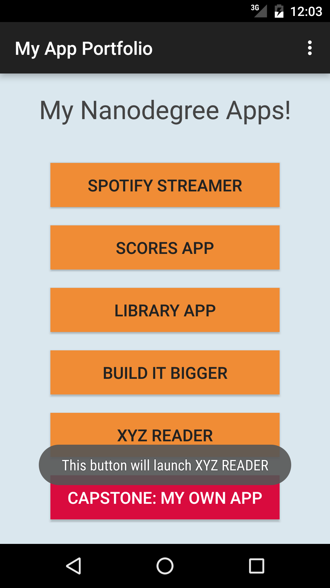

#### MyAppPortfolio - Project 0, Android Nanodegree Course, Udacity

This app is the first one I created.

Few things I learned/ implemented in this project:

* Basics about activity and layout
* Showing toast
* Handling button click

